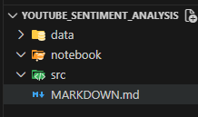

# ML Pipeline Development
###  ML Pipeline tracking using **DVC**
---
1. Data Ingestion 
- The process of collecting, importing, and transferring raw data from multiple sources into a centralized system (data lake, data warehouse, or feature store) where it can be processed for machine learning.
2. Data preprocessing
- The systematic process of cleaning, transforming, validating, and structuring raw data so it becomes suitable for machine learning algorithms.<br>

    a. **Data cleaning** <br>
    - Data cleaning removes errors, inconsistencies, and noise that distort learning. It includes handling missing values (deletion, mean/median/mode imputation), correcting incorrect entries, removing duplicates, and filtering out irrelevant records. Clean data ensures statistical assumptions are not violated during training.

    b. **Handling Missing Data**<br>
    - Missing data is addressed through imputation techniques (mean, median, regression, KNN) or row/column removal when absence is systematic. The strategy depends on data distribution and missingness type (MCAR, MAR, MNAR). Incorrect handling introduces bias and variance inflation.

    c. **Outlier Detection and Treatment**
    - Outliers are extreme values that can skew model parameters. Detection methods include Z-score, IQR, and model-based approaches. Treatment involves removal, capping, or transformation depending on domain relevance. Outlier handling stabilizes loss functions and gradient updates.

    d. **Data Transformation**

    e. **Feature Scaling**
    - Bringing all numerical features into similar ranges mostly in decimal palces for faster convergence. If one feature has values in thousands and another in decimals, many ML algorithms will incorrectly treat the larger-scale feature as more important. The methods are **z-score** where center data around zero with min max value within -1 and 1 or unit variance. The other method is **normalization (min-max)** where the values are rescaleds to fixed range between 0 and 1. Distance-based models (KNN, SVM), gradient-based models (linear/logistic regression), and regularized models are sensitive to scale because they rely on distances or coefficient sizes during optimization. Without scaling, these models learn biased and unstable patterns.<br>

    f.  **Endcoding Categorical Varaibles**
    - Categorical data is converted into numeric form using label encoding, one-hot encoding, ordinal encoding, or target encoding. The encoding choice affects dimensionality, sparsity, and information leakage. Proper encoding preserves semantic meaning.

    g. **Feature Engineering**
    - Feature engineering creates new informative variables using domain knowledge (aggregations, interactions, ratios, time-based features). This step often contributes more to performance gains than model selection itself.
    
    h. **Feature Selection**
    -  Feature selection means keeping only the useful input variables and removing the ones that do not help prediction. Some features add no new information or repeat what other features already explain, which can confuse the model instead of helping it. <br>
    By removing these unnecessary features, the model becomes simpler, faster, and easier to understand. Fewer features reduce noise, help the model focus on real patterns, and prevent it from memorizing the data (overfitting) instead of learning general rules
    
    i. **Data Splitting**
    - Data is divided into training, validation, and test sets to prevent information leakage and enable unbiased evaluation.
    
    j. **Data Validation**
    - Data validation means checking that incoming data still looks the way the model expects. It verifies that columns exist (schema), values stay within allowed limits (range checks), data types are correct, and data patterns have not changed over time (distribution drift). These checks catch problems early before they silently damage model predictions.

    k. **EDA**
    - EDA is the decision-making layer of an ML pipeline. It does not modify data; it explains it. Every preprocessing step—scaling, transformation, feature selection—should be justified by insights from EDA. Skipping EDA leads to fragile models built on unchecked assumptions. Strong ML systems treat EDA as mandatory, not optional.
3. Model Building
4. Model Evaluation with **mlflow** - Save all the artificats in mlflow to track later on
5. Model Registration in mlflow and create API with help of flask  and use the model, develop chrom plugin.

**NOTE: Create repository and clone the repository and clone the repository in particular local directory.**

### To see the files and folder icons installed extension called **Material Icon Theme** from Extensions. 


Step 1: Create virtual environment and activate
```python
python -m venv .venv
.venv\Scripts\activate
```
Step 2: Install requirement.txt
```python
pip install -r requirements.txt

pip install -r requirements.txt --timeout 1000


# Command to see all the installed libraries/modules
pip list
```
Step 3: git init

Step 4: dvc init
- Initialization sets up basic rules and structures so system knows how to work before doing any real task. dvc init means initializing Data Version Control (DVC) in your project so the project knows how to track data, models, and ML pipelines in a structured way. It is a one-time setup step that tells the project environment:

Step to check dvc 